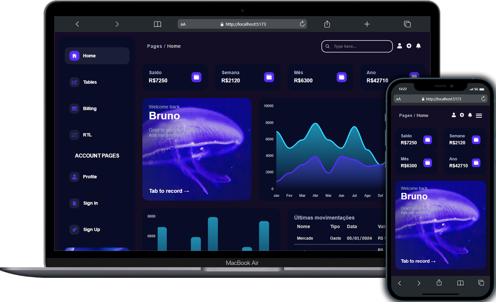

<h1 align='center'>Dashboard</h1>
<h2 align='center'>Projeto de dashboard criado para estudo e pratica do framework React, layout utilizado como base do designer <a href='https://www.creative-tim.com/'>Tim</a><h2/>

<h1 align='center'>Tecnologias utilizadas</h1>

    
    
    
    
    

